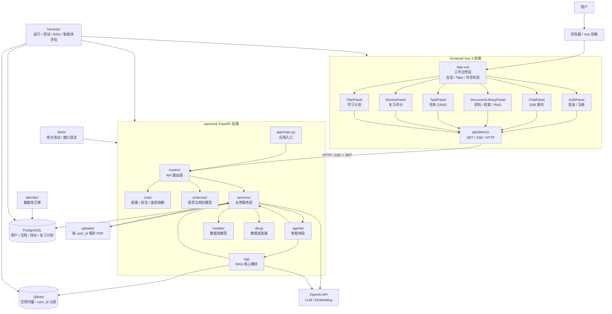

# EduMate — 代码架构图与目录职责

> **文档用途**：说明 EduMate 的代码分层、目录职责和模块协作关系。后续开发、讨论功能归属、拆分任务时，以本文档作为代码结构参考。

---

## 1. 总体代码架构图



---

## 2. 代码目录职责表

| 层级 | 目录 / 文件 | 职责 |
| --- | --- | --- |
| 项目根 | `docker-compose.yml` | 编排 PostgreSQL、Qdrant、后端、前端等本地服务，实现一键启动。 |
| 项目根 | `README.md` | 项目介绍、快速启动、演示说明和部署说明。 |
| 项目根 | `docs/` | 可选文档目录，用于沉淀接口说明、架构设计、演示材料。 |
| Harness 层 | `harness/` | Harness 工程目录，存放一键检查脚本、样例数据、RAG/智能体评估集和运行报告。 |
| Harness 层 | `harness/scripts/` | PowerShell 或命令脚本，例如启动检查、数据初始化、总体验证入口。 |
| Harness 层 | `harness/fixtures/` | 固定测试数据，例如测试用户、样例 PDF、样例待办、复习知识点。 |
| Harness 层 | `harness/evals/` | 评估集，例如 RAG 问题集、意图识别样例、Planner 样例。 |
| Harness 层 | `harness/runners/` | Python 检查程序，例如 API 冒烟、用户隔离、RAG eval、SSE 检查。 |
| Harness 层 | `harness/reports/` | 保存 Harness 运行结果，用于对比迭代前后的表现。 |
| 后端根 | `backend/` | FastAPI 后端服务根目录，承载认证、业务 API、智能体和 RAG。 |
| 后端应用 | `backend/app/main.py` | FastAPI 应用入口，注册路由、中间件、异常处理和健康检查。 |
| 后端应用 | `backend/app/db.py` | PostgreSQL 连接、Session 管理、SQLAlchemy Base 声明。 |
| 后端核心层 | `backend/app/core/` | 横切基础能力，包括配置、安全、鉴权依赖。 |
| 后端核心层 | `backend/app/core/config.py` | 读取和管理环境变量，例如数据库地址、OpenAI Key、JWT 配置、Qdrant 地址。 |
| 后端核心层 | `backend/app/core/security.py` | 密码哈希、密码校验、JWT 生成与解析。 |
| 后端核心层 | `backend/app/core/deps.py` | FastAPI 依赖注入，例如 `get_db`、`get_current_user`。 |
| 数据模型层 | `backend/app/models/` | SQLAlchemy 表模型目录。 |
| 数据模型层 | `backend/app/models/user.py` | `users` 表模型，存储账号、邮箱、密码哈希等信息。 |
| 数据模型层 | `backend/app/models/document.py` | `documents` 表模型，记录当前用户上传的 PDF 和处理状态。 |
| 数据模型层 | `backend/app/models/task.py` | `tasks` 表模型，记录用户待办事项。 |
| 数据模型层 | `backend/app/models/review.py` | `review_schedule` 表模型，记录 SM-2 复习知识点。 |
| Schema 层 | `backend/app/schemas/` | Pydantic 请求与响应模型目录，用于接口入参校验和响应结构约束。 |
| Schema 层 | `backend/app/schemas/auth.py` | 注册、登录、当前用户相关请求和响应结构。 |
| Schema 层 | `backend/app/schemas/document.py` | 文档上传、文档列表、处理状态相关结构。 |
| Schema 层 | `backend/app/schemas/task.py` | 待办创建、更新、返回结构。 |
| Schema 层 | `backend/app/schemas/review.py` | 复习知识点创建、今日复习、评分更新结构。 |
| API 路由层 | `backend/app/routers/` | HTTP API 路由目录，只处理请求入口、鉴权、参数接收和响应返回。 |
| API 路由层 | `backend/app/routers/auth.py` | `/api/auth/register`、`/api/auth/login`、`/api/auth/me`。 |
| API 路由层 | `backend/app/routers/chat.py` | `/api/chat`，统一聊天入口，返回 SSE 流式响应。 |
| API 路由层 | `backend/app/routers/documents.py` | `/api/documents`，文档上传、列表、状态查询、删除。 |
| API 路由层 | `backend/app/routers/tasks.py` | `/api/tasks`，待办 CRUD。 |
| API 路由层 | `backend/app/routers/plan.py` | `/api/plan/generate`，学习计划生成。 |
| API 路由层 | `backend/app/routers/review.py` | `/api/review`，今日复习、知识点添加、复习评分。 |
| 业务服务层 | `backend/app/services/` | 业务用例编排层，负责数据库、文件、智能体、LLM 等模块协作。 |
| 业务服务层 | `backend/app/services/auth_service.py` | 用户注册、登录校验、用户查询。 |
| 业务服务层 | `backend/app/services/document_service.py` | 文件保存、PDF 处理任务调度、文档状态流转、删除同步。 |
| 业务服务层 | `backend/app/services/task_service.py` | 待办创建、查询、更新、删除，所有查询按 `user_id` 隔离。 |
| 业务服务层 | `backend/app/services/review_service.py` | 复习池管理、今日复习查询、SM-2 间隔计算。 |
| 业务服务层 | `backend/app/services/llm_service.py` | OpenAI LLM 调用封装、流式输出、重试和错误处理。 |
| 智能体层 | `backend/app/agents/` | 自然语言任务理解与分发层。 |
| 智能体层 | `backend/app/agents/master_agent.py` | 主智能体，负责意图识别、置信度判断和任务路由。 |
| 智能体层 | `backend/app/agents/knowledge_agent.py` | 知识库智能体，负责调用 RAG 检索并生成课件问答。 |
| 智能体层 | `backend/app/agents/planner_agent.py` | 规划智能体，负责计划生成、自然语言待办创建/查询/更新。 |
| RAG 层 | `backend/app/rag/` | RAG 核心能力目录，尽量保持可独立测试。 |
| RAG 层 | `backend/app/rag/parser.py` | PDF 文本提取、页信息提取、标题候选识别。 |
| RAG 层 | `backend/app/rag/chunker.py` | 层级化分块、标题路径保留、token 长度控制。 |
| RAG 层 | `backend/app/rag/embedding.py` | Embedding 生成、批量向量化、Embedding 调用重试。 |
| RAG 层 | `backend/app/rag/vector_store.py` | Qdrant Collection 管理、向量写入、按 `user_id` 检索和删除。 |
| RAG 层 | `backend/app/rag/bm25_store.py` | BM25 关键词索引与关键词检索。 |
| RAG 层 | `backend/app/rag/retriever.py` | 混合检索入口，合并向量检索和 BM25，并用 RRF 排序。 |
| RAG 层 | `backend/app/rag/prompt_builder.py` | RAG 上下文拼装和 Prompt 模板构造。 |
| 数据迁移 | `backend/alembic/` | 数据库迁移脚本目录，管理表结构演进。 |
| 文件存储 | `backend/uploads/` | 本地上传文件目录，按 `user_id` 分目录保存 PDF。 |
| 后端测试 | `backend/tests/` | 后端单元测试、接口测试、RAG 测试、用户隔离测试。 |
| 前端根 | `frontend/` | Vue 3 前端应用根目录。 |
| 前端入口 | `frontend/src/main.ts` | Vue 应用入口，挂载根组件。 |
| 前端壳层 | `frontend/src/App.vue` | 工作台壳层，负责会话恢复、tab 切换、共享状态、全局提示和各业务面板挂载。 |
| 前端 API 层 | `frontend/src/api/` | 后端 API 调用封装，统一处理 JWT、错误和 SSE。 |
| 前端 API 层 | `frontend/src/api/client.ts` | HTTP/SSE 客户端，封装登录注册、文档、RAG、聊天、任务、复习和计划接口。 |
| 前端组件层 | `frontend/src/components/` | 业务面板组件目录，每个面板独立维护表单状态、局部 loading 和错误上抛。 |
| 前端组件层 | `frontend/src/components/AuthPanel.vue` | 登录/注册表单、校验、认证请求和认证成功事件。 |
| 前端组件层 | `frontend/src/components/ChatPanel.vue` | 聊天消息列表、输入框、SSE 流式渲染、引用展示。 |
| 前端组件层 | `frontend/src/components/DocumentLibraryPanel.vue` | PDF 上传、资料刷新、文档范围选择、chunk 检索和 RAG 问答。 |
| 前端组件层 | `frontend/src/components/TaskPanel.vue` | 任务创建、完成/取消完成、删除和任务列表展示。 |
| 前端组件层 | `frontend/src/components/ReviewPanel.vue` | 复习项创建、今日复习列表和掌握程度评分。 |
| 前端组件层 | `frontend/src/components/PlanPanel.vue` | 学习计划生成、计划结果展示，并在生成后刷新任务列表。 |

---

## 3. 分层调用规则

| 规则 | 说明 |
| --- | --- |
| 路由层不写复杂业务 | `routers/` 只负责 HTTP 入口、鉴权、参数和响应，复杂逻辑交给 `services/`。 |
| 服务层负责业务编排 | `services/` 可以调用数据库、文件系统、LLM、智能体和 RAG 模块。 |
| 智能体层负责理解与决策 | `agents/` 处理意图识别、自然语言任务拆解和路由，不直接承担底层存储细节。 |
| RAG 层保持可测试 | `rag/` 模块尽量输入输出清晰，便于单独测试 PDF 分块、检索和 Prompt 拼装。 |
| 用户隔离是硬约束 | 所有业务查询、Qdrant 检索和删除都必须绑定当前 `user_id`。 |
| 前端 API 统一封装 | 前端页面和组件不直接拼接请求细节，统一通过 `src/api/` 调用后端。 |

---

## 4. 典型请求链路

### 4.1 用户登录

```text
AuthPanel.vue
  -> api/client.ts
  -> routers/auth.py
  -> services/auth_service.py
  -> models/user.py
  -> core/security.py
  -> PostgreSQL
```

### 4.2 上传 PDF

```text
DocumentLibraryPanel.vue
  -> api/client.ts
  -> routers/documents.py
  -> services/document_service.py
  -> uploads/{user_id}/
  -> rag/parser.py
  -> rag/chunker.py
  -> rag/embedding.py
  -> rag/vector_store.py
  -> PostgreSQL + Qdrant
```

### 4.3 课件问答

```text
ChatPanel.vue
  -> api/client.ts
  -> routers/chat.py
  -> agents/master_agent.py
  -> agents/knowledge_agent.py
  -> rag/retriever.py
  -> rag/prompt_builder.py
  -> services/llm_service.py
  -> SSE stream
```

### 4.4 生成学习计划

```text
PlanPanel.vue
  -> api/client.ts
  -> routers/plan.py
  -> agents/planner_agent.py
  -> services/llm_service.py
  -> services/task_service.py
  -> PostgreSQL
```
