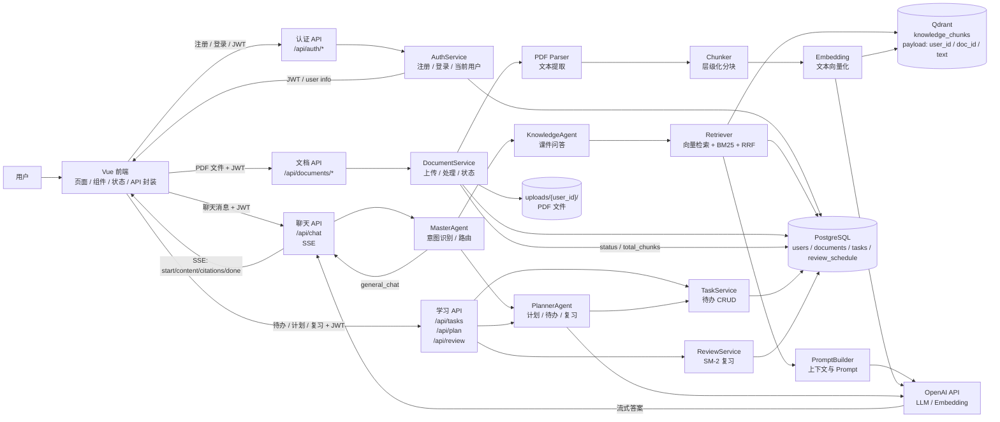
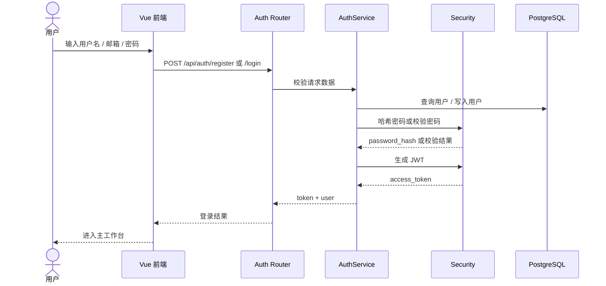
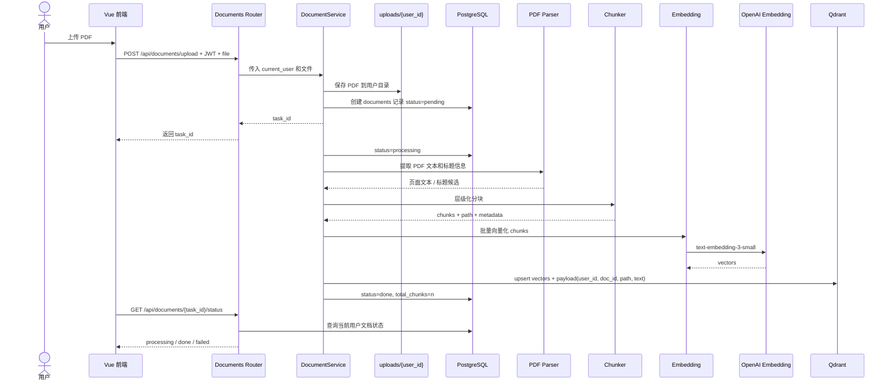
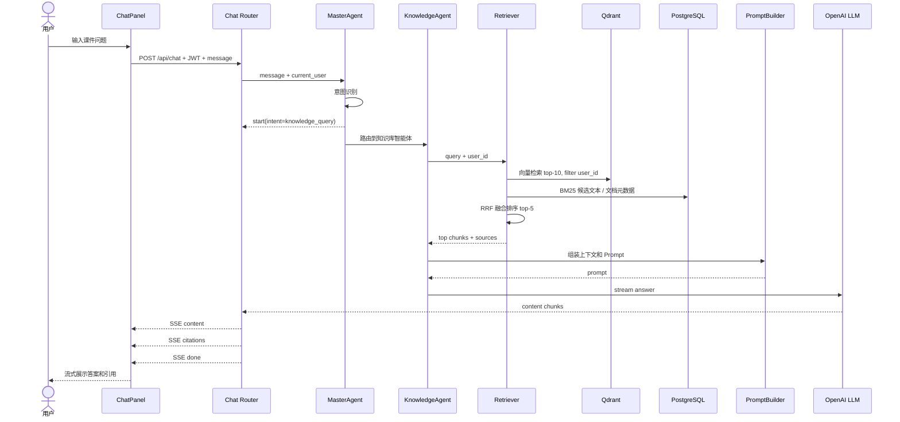
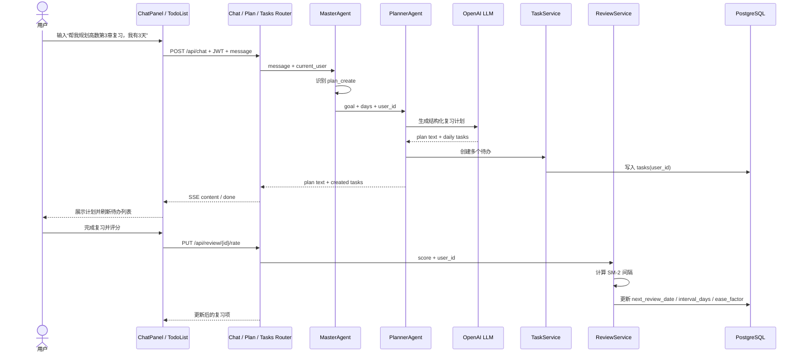
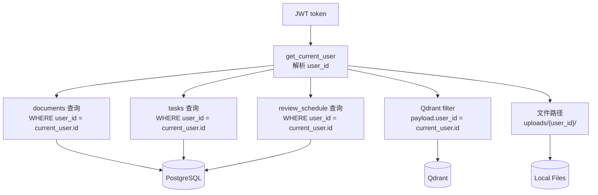

# EduMate — 数据流图

> **文档用途**：说明 EduMate 中核心数据如何在前端、后端、智能体、RAG、数据库和外部模型之间流动。  
> **阅读方式**：先看总体数据流，再看登录、PDF 入库、课件问答、学习计划四条核心链路。

---

## 1. 总体数据流图



---

## 2. 登录注册数据流



**关键数据**

| 数据 | 来源 | 去向 | 说明 |
| --- | --- | --- | --- |
| `username` / `email` / `password` | 用户输入 | Auth API | 注册或登录凭据 |
| `password_hash` | Security | PostgreSQL | 只保存哈希，不保存明文密码 |
| `access_token` | Security | 前端 | 后续请求放入 `Authorization` |
| `user_id` | PostgreSQL | 后端上下文 | 所有业务查询的数据隔离依据 |

---

## 3. PDF 上传与向量入库数据流



**关键数据**

| 数据 | 来源 | 去向 | 说明 |
| --- | --- | --- | --- |
| PDF 文件 | 前端上传 | `uploads/{user_id}/` | 原始课件文件 |
| `documents` 记录 | DocumentService | PostgreSQL | 文件名、路径、状态、分块数量 |
| chunk metadata | Parser + Chunker | PostgreSQL / Qdrant payload | 包含 `user_id`、`doc_id`、`path`、`text` |
| embedding vector | OpenAI Embedding | Qdrant | 用于语义检索 |
| `user_id` filter | 当前登录用户 | Qdrant 检索/删除 | 多用户隔离硬约束 |

---

## 4. 课件问答 RAG 数据流



**SSE 数据格式**

```text
data: {"type": "start", "intent": "knowledge_query"}
data: {"type": "content", "text": "最大似然估计是一种..."}
data: {"type": "citations", "sources": ["第2章 > 2.1 最大似然估计"]}
data: {"type": "done"}
```

**关键数据**

| 数据 | 来源 | 去向 | 说明 |
| --- | --- | --- | --- |
| `message` | 用户 | MasterAgent | 用于意图识别 |
| `intent` | MasterAgent | Chat Router / 前端 | 告诉前端当前任务类型 |
| query embedding | Retriever | Qdrant | 语义检索使用 |
| top chunks | Qdrant + BM25 | PromptBuilder | 构造 RAG 上下文 |
| citations | Retriever | 前端 | 展示引用来源 |
| stream content | OpenAI LLM | 前端 | SSE 流式回答 |

---

## 5. 学习计划与待办数据流



**关键数据**

| 数据 | 来源 | 去向 | 说明 |
| --- | --- | --- | --- |
| 学习目标 | 用户输入 | PlannerAgent | 计划生成输入 |
| 计划文本 | OpenAI LLM | 前端 | 展示给用户 |
| daily tasks | PlannerAgent | TaskService | 自动创建待办 |
| `tasks.user_id` | 当前用户 | PostgreSQL | 待办数据隔离 |
| 复习评分 | 用户 | ReviewService | SM-2 更新依据 |
| `next_review_date` | ReviewService | PostgreSQL | 下次复习时间 |

---

## 6. 多用户数据隔离流



**隔离规则**

| 数据位置 | 隔离方式 |
| --- | --- |
| PostgreSQL `documents` | 所有查询、更新、删除必须带 `user_id` |
| PostgreSQL `tasks` | 所有查询、更新、删除必须带 `user_id` |
| PostgreSQL `review_schedule` | 所有查询、更新、删除必须带 `user_id` |
| Qdrant `knowledge_chunks` | payload 必须包含 `user_id`，检索和删除必须 filter |
| 本地 PDF 文件 | 保存到 `uploads/{user_id}/` |
| 前端状态 | 退出登录时清空 token、用户信息、文档、待办、聊天状态 |

---

## 7. 数据流检查清单

| 检查项 | 判断标准 |
| --- | --- |
| 未登录访问业务接口 | 返回 401 |
| 登录后请求业务接口 | 请求头携带 `Authorization: Bearer <token>` |
| 文档上传 | 文件进入 `uploads/{user_id}/`，数据库写入当前用户文档 |
| 向量入库 | Qdrant payload 包含 `user_id` 和 `doc_id` |
| RAG 检索 | Qdrant 检索带 `user_id` filter |
| 待办查询 | 只返回当前用户待办 |
| 复习查询 | 只返回当前用户复习项 |
| 退出登录 | 前端清空 token 和业务状态 |
| SSE 输出 | 事件顺序符合 `start -> content -> citations -> done` |

